# ANa Robe
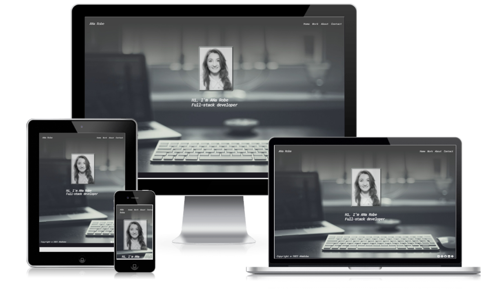

This website is a web developer's résumé extention. It aims to showcase programming the skills and languages accquired through Code Institute's Program.

The website will be targeted towards recruiters, privats and companies.

This website is the first of five projects that needs to be completed in order to receive a diploma in Software Development from The Code Institute.

Requirements for this present project is that the website has to be static and responsive using HTML5 and CSS3.

A live version of the site can be found here: https://anarobe.github.io/Portfolio_One/index.html

## UX

###  

This website has been designed to point in the right direction the potential clients and provide a convenient way to analise the Full-stack web developer's programming skills.

### User Goals

To have  an efficient way to analiseweb developer's programming skills in discussion. 
The user will use this website as an instrument that eases the recruitment process, having all resources and Informations about a potential contracter gathered in just one place.

### Design

The design is a minimalistic one and was influenced by the home page's background image - a laptop on a ndesk.

The decision for this picture was made almost instantly, only by one google search. 

By placing the portrait picture right in the center and the short introduction "Full-Stack-developer" underlining it, invites the users to imagine the creation environment and it's main character. 

### Colour
 
The choice for a dark background [rgb(2, 21, 21);] has the purpose to introduce the reader in the environment we just discussed about.

### Typography 

Having this design in mind, the Roboto font in color: whitesmoke; color passes perfect on the black.

The fonts used for this project were from https://fonts.google.com/.

Icons for the social media links from https://fontawesome.com/.

The fonts used for the entire body:  'ROBOTO MONO',monospace, sans-serif;.

Images have been chosen and edited in accordance to colour and content.

## Features

### Header and Navigation bar

Featured on all 4 pages, the full responsive navigation bar includes links to the Home page, Work, About and Contact page and is identical in each page to allow for easy navigation.
This section will allow the user to easily navigate from page to page without having to revert back to the previous page via 'back' button.
An extra page was created to be accessed when the links to future projects are clicked and it will display:"Coming soon!" message.

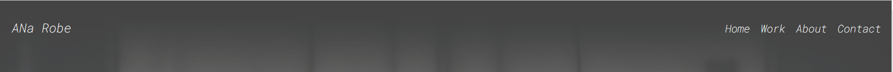

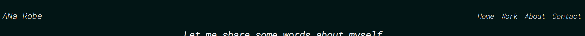

### Home page

The Home page consists of a Portrait Picture with   border-color: rgb(157, 162, 162);and an introductory message. When hovered over,it loses opacity and a pointer appeares, inviting  the user to click on it. That link will open the "About" page.

The  intro "Hi, I am ANa Robe, Full-Stack-developer" has the same feature that will lead the user to the "Work" page.

This section introduces the user to the Information he needs to know about the web developer only by  clicking them.

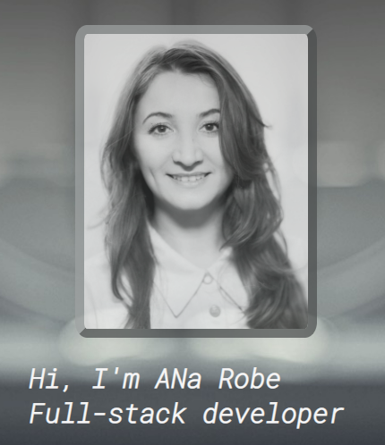

### Work page

The Work page consists of three clickable images underlined by their title with the same features. Each section is divided by a styling line of color: rgb(142, 160, 160); which is the common on all 3 pages: Work, About, Contact.

Each image represents a programming language in which the programmer created ceratin projects.                                                                            
All three of them react by hoverring over -  transform and 50% opacity- and are clickable, inviting the user to explore the Milestone projects made during the Code Institute course.

- HTML&CSS Image will send the user to the Home page of the website in discussion

- JavaScript and Python images will open a page with the message Great things coming soon!" to let the user know that in the future he will be able to discover new projects created in those programming languages.

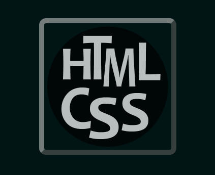                             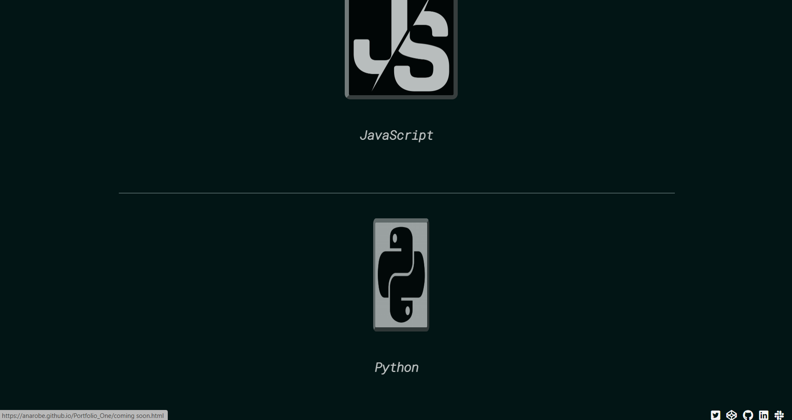

### About page

In the About page the web developer offers himself the oportunity to shortly describe his past experience and to motivate his decision in choosing web development.

Scrolling down the page, the user is able to find also some testimonials from past employers and colleagues  which highlights his personality traits in the work field.

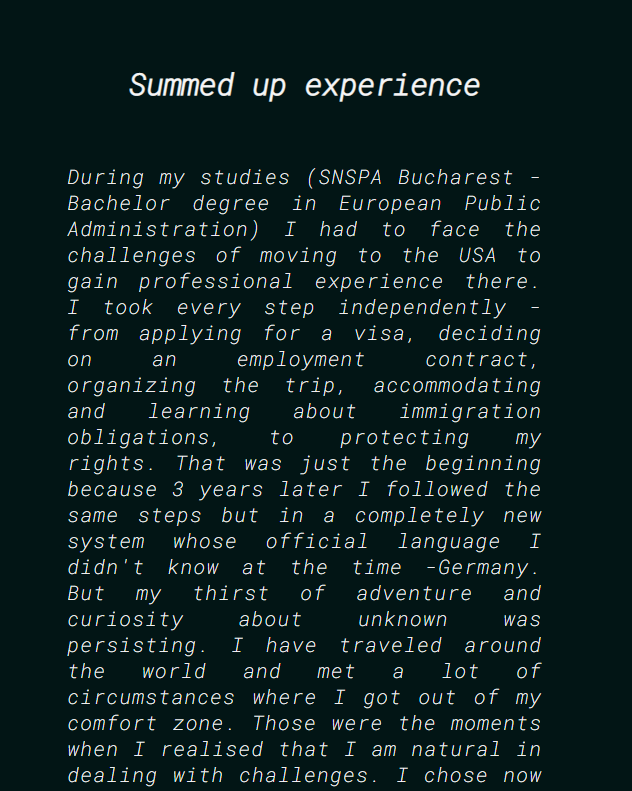                      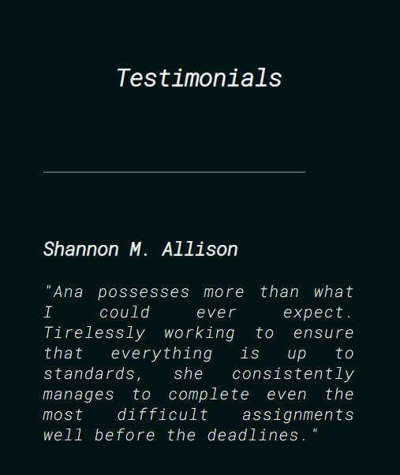

### Contact page

The Contact page displays one section where the user finds the web developer's adress, telephone number email adress and website. The user has also the pssibility to send a message directly through the message box section. By introducing his name, surname and a valid email adress (respecting the format)  he will be able to contact the programmer.

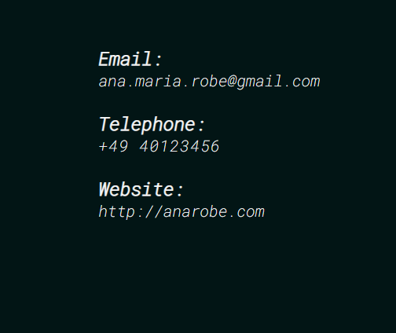                          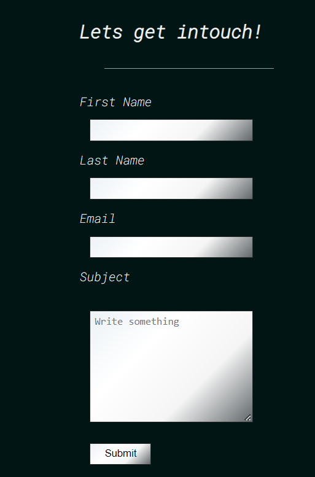

### Footer

The footer contains five links (Twitter, Codepen, Github, Linkedin and Slack).

The purpose of this footer is to provide more access to the works of the web developer and social media .

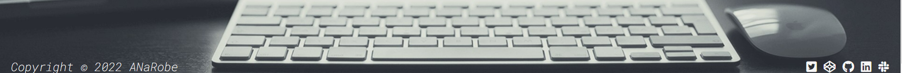

### Technologies Used
* HTML
* CSS

### Testing

After clearing the 

## Validator testing

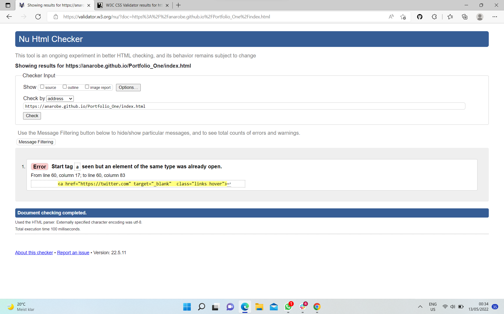

## Lighthouse testing

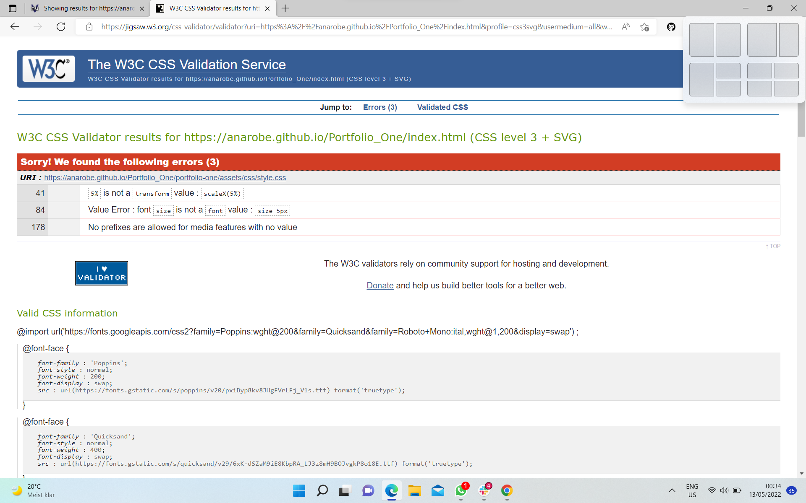

* CSS validator issues: I changed font-size as percentages, and the value of scaleX as 0.05 instead of the percentage.

## Testing and Bugs

* Responsiveness on iPhone4 resolution had to be fixed. 
- The solution was  burger menu for the navigation ( via media query)
* Email validation had to be fixed.
- I have changed the input for email according to: https://www.w3schools.com/tags/att_input_type_email.asp
* In media query the logo was not responding to .links class. Therefore I have applied the same class for the anchor, as for the h2.

### Deployment

The site was deployed to GitHub pages. The steps to deploy are as follows:

In the GitHub repository, navigate to the Settings tab.

From the source section drop-down menu, select the Master Branch.

Once the master branch has been selected, the page will be automatically refreshed with a detailed ribbon display to indicate the successful deployment.

The live link can be found here -  https://anarobe.github.io/Portfolio_One/index.html

### Credit

The code for the burger menu was taken from:

https://alvarotrigo.com/blog/hamburger-menu-css/

Instructions on how to implement contact form was taken from:

https://www.w3schools.com/
https://www.w3schools.com/howto/howto_css_contact_form.asp#:~:text=%3Cinput%20type%3D%22text%22,%22Your%20name..%22%3E

and

https://developer.mozilla.org/en-US/docs/Web/HTML/Element/input/email

Instructions on how to make a section to have 100% width and height of the window:

https://stackoverflow.com/questions/22247178/html-sections-100-height-of-viewport

Resource to understand flex-box:

http://flexboxfroggy.com/

The icons in the footer and the Work page were taken from Font Awesome.

### Media

The photo used on the home page as background image is from This Open Source site:

https://giacomobattocchio.it/wp-content/uploads/2021/01/cropped-wallpaperflare.com_wallpaper-1-e1613147244929.jpg

### Acknowledgements

 I'd like to give thanks to;

* Martina Terlevic

* Kasia Bogucka

* Ionut Ciobanu

### Sources

Sites that provided me with helpful information and resolved many of my issues:
-  https://www.w3schools.com/
- https://stackoverflow.com/

The top screen shot for responsive design was taken from:

https://ui.dev/amiresponsive

Thank you!